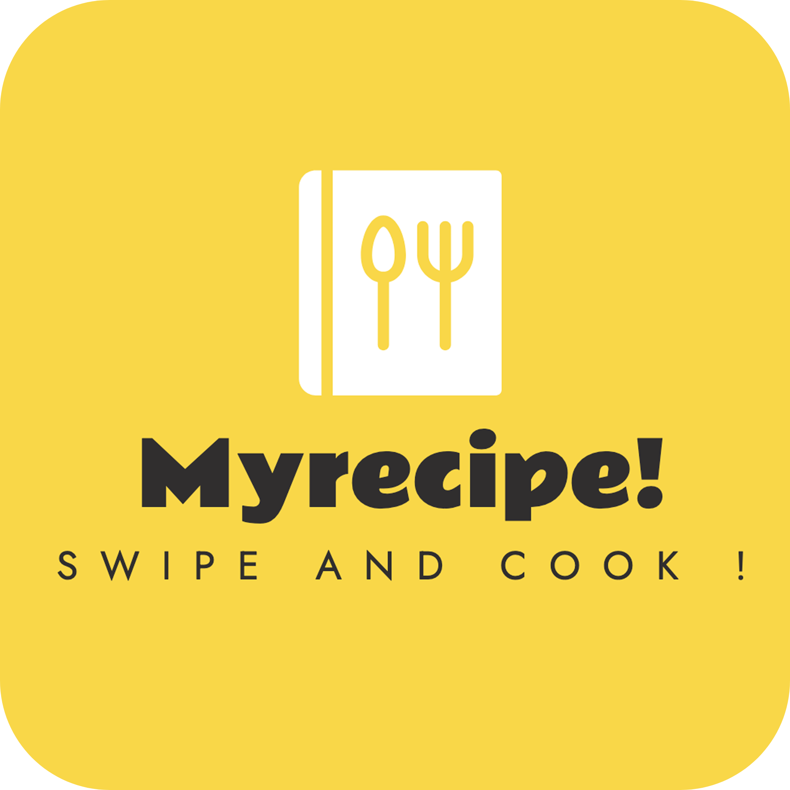
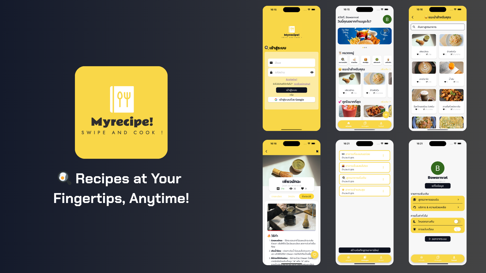

<h1 align="center">
  <br>
  
  <br>
  <br>
  <span>🍳 MyRecipe!</span>
  <br>
</h1>

<p align="center">Share and inspire cooking experiences.</p>

## 💭 Pain Points

- <b>Want to cook but don't know where to start</b> - For beginners, starting to cook can be difficult because there are no easy-to-understand guidelines and instructions.
- <b>Scattered recipes</b> - Recipes are often spread across multiple platforms, some lack clear steps, and some websites are filled with ads.
- <b>Lack of recipe-sharing community</b> - Many people want to share recipes or get ideas from others, but there isn't a convenient platform to do so.

## 🧑🏻‍🍳 Objectives

This application is designed to be a hub for cooking enthusiasts, whether they are beginners learning to cook or professional chefs wanting to share their signature recipes. The main goal is to create a platform that is <b>easy to use, convenient, and full of cooking inspiration.</b>

## 📸 Screenshots



## 🚀 Features

- <b>View Recipes</b> – Users can view descriptions, ingredients, and step-by-step instructions for all recipes within the app.
- <b>Publish and Edit Recipes</b> – Users can create and edit descriptions, ingredients, and step-by-step instructions for their own recipes.
- <b>Browse Recipes by Category</b> – The system organizes recipes into categories, such as ... etc., for convenient searching.
- <b>Search Recipes Within Categories</b> – The recipe search system within desired categories helps users find recipes more quickly.
- <b>Create and Edit Recipe Collections</b> – Create and edit recipe collections to save recipes.
- <b>Save Interesting Recipes</b> – Add desired recipes to "Recipe Collections" to view later.
- <b>Change Application Theme</b> – Supports light and dark modes for convenient usage.
- <b>Notification System</b> – User notification system at set times: 7:00 AM, 12:00 PM, and 5:00 PM to encourage users to engage with the app.

## 🛠️ Tech. Stacks

- <b>Framework</b>: Flutter
- <b>Language</b>: Dart
- <b>Backend</b>: Firebase, Supabase

## 📂 Project Structure

```bash
my-recipe/
├── assets/
│   ├── fonts/
│   └── images/
└─ lib/
   ├── core/
   ├── firebase_options.dart
   ├── main.dart
   ├── models/
   ├── providers/
   ├── screens/
   ├── services/
   └── widgets/
```

## ⚙️ Dependencies

```yaml
flutter:
  sdk: flutter
flutter_riverpod: ^2.6.1
cupertino_icons: ^1.0.8
firebase_core: ^3.12.1
firebase_auth: ^5.5.1
google_sign_in: ^6.3.0
cloud_firestore: ^5.6.5
supabase_flutter: ^2.8.4
sliding_up_panel: ^2.0.0+1
image_picker: ^1.1.2
video_player: ^2.9.3
flutter_markdown: ^0.7.6+2
carousel_slider: ^5.0.0
flutter_local_notifications: ^19.0.0
timezone: ^0.10.0
flutter_timezone: ^4.1.0
flutter_dotenv: ^5.2.1
```

## 🧑🏻‍💻 Getting Started

- Clone the projects.

```bash
git clone https://github.com/thg1rb/my-recipe.git
cd my-recipe
```

- Get all dependencies.

```bash
flutter pub get
```

- Run the program in debug mode.

```bash
flutter run
```

## 📎 Addition

- [Figma Design](https://www.figma.com/design/f57ukwitagkYS50WAEXneB/MyRecipe!?node-id=0-1&t=rvE1B9uK77SaUaP3-1)
- [Pitch Deck](https://www.canva.com/design/DAGjGNcuk8s/EUvvb3GQjn6zl0LNqaNe4A/edit?utm_content=DAGjGNcuk8s&utm_campaign=designshare&utm_medium=link2&utm_source=sharebutton)
